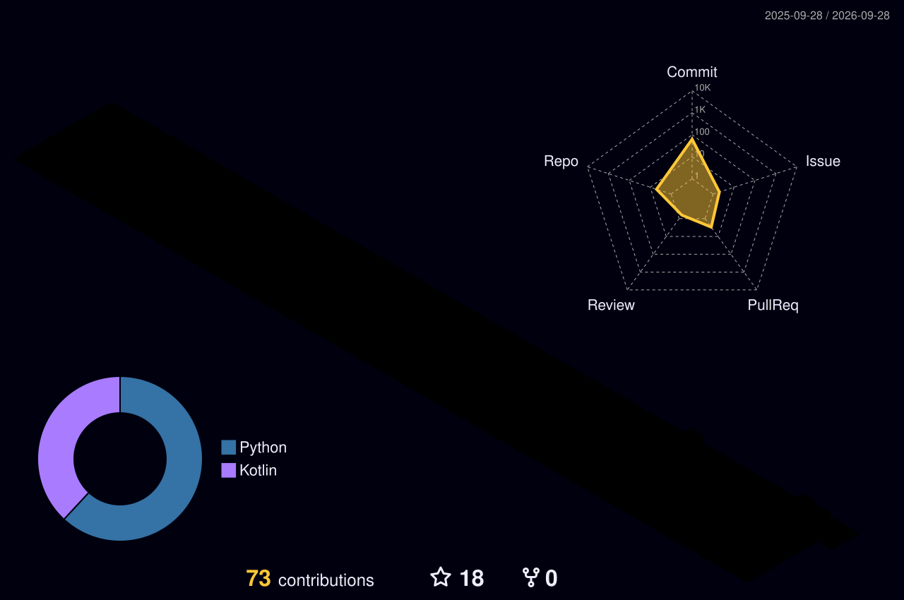

  

  
  
  

---

### About

Developer from India building tools, systems, and applications.

- **Current Focus**: Multi-agent systems, data hiding algorithms, and native applications.
- **Languages & Areas**: Python, Kotlin, Machine Learning / Steganography, Android tooling.
- **Portfolio**: [kkarmugil.github.io/Portfolio](https://kkarmugil.github.io/Portfolio/)
- **GitHub**: [@karmugilen](https://github.com/karmugilen)

---

### Featured Projects

<table>
  <tr>
    <td width="50%" valign="top">
      <h3 align="center"><a href="https://github.com/karmugilen/mem">mem</a></h3>
      
<em>Daily journal as latent memory for humans and AI coding agents. Sparse cues, zero-friction recall.</em>

      

        
        
      

    </td>
    <td width="50%" valign="top">
      <h3 align="center"><a href="https://github.com/karmugilen/pdf-rag-langchain-lab">pdf-rag-langchain-lab</a></h3>
      
<em>Interactive PDF RAG pipeline powered by LangChain, ChromaDB, and Gemini/Gemma models.</em>

      

        
        
        
      

    </td>
  </tr>
  <tr>
    <td width="50%" valign="top">
      <h3 align="center"><a href="https://github.com/karmugilen/torrent-player">torrent-player</a></h3>
      
<em>Native Android media streamer and bit-torrent player engine.</em>

      

        
        
        
      

    </td>
    <td width="50%" valign="top">
      <h3 align="center"><a href="https://github.com/karmugilen/LSB-Steganography-Toolkit">LSB-Steganography-Toolkit</a></h3>
      
<em>Steganography suite for image data hiding with real-time capacity and quality analytics.</em>

      

        
        
        
      

    </td>
  </tr>
</table>

---

### Tech Stack & Skills

  

---

### GitHub Activity & Metrics

  
  

  

  
<b>View 3D Contribution Graph</b>

   
  

    
  

---

### Contribution Activity

  <picture>
    <source media="(prefers-color-scheme: dark)" srcset="https://raw.githubusercontent.com/karmugilen/karmugilen/output/github-contribution-grid-snake-dark.svg" />
    <source media="(prefers-color-scheme: light)" srcset="https://raw.githubusercontent.com/karmugilen/karmugilen/output/github-contribution-grid-snake.svg" />
    
  </picture>

